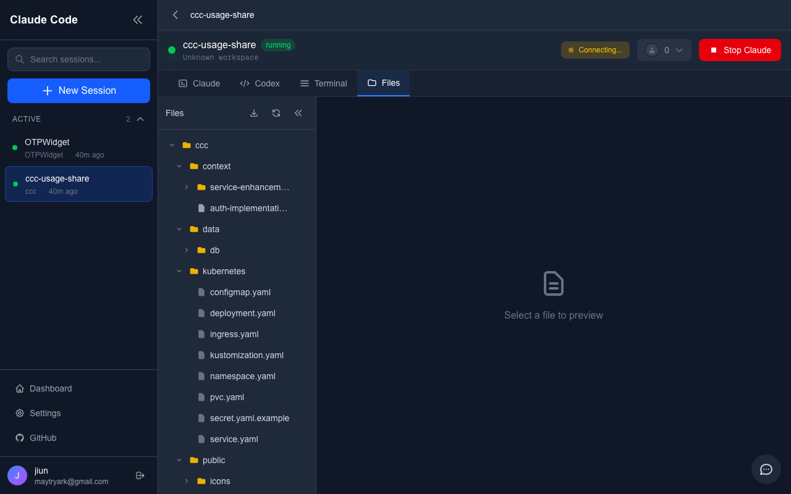

<div align="center">

# Claude Code Cloud

### Run Claude Code in the Cloud

[](https://opensource.org/licenses/MIT)
[](https://nextjs.org/)
[](https://react.dev/)
[](https://www.typescriptlang.org/)
[](https://www.docker.com/)

**Powerful AI-powered coding sessions in your browser.**
No local setup required. Collaborate in real-time.

[**Live Demo**](https://claude.jiun.dev) · [**Documentation**](#getting-started) · [**Report Bug**](https://github.com/jiunbae/claude-code-cloud/issues)

</div>

---

## Screenshots

<div align="center">
<table>
<tr>
<td align="center"><strong>Claude Terminal</strong></td>
<td align="center"><strong>File Explorer</strong></td>
</tr>
<tr>
<td></td>
<td></td>
</tr>
<tr>
<td colspan="2" align="center"><strong>Dashboard</strong></td>
</tr>
<tr>
<td colspan="2" align="center"></td>
</tr>
</table>
</div>

---

## Features

| Feature | Description |
|---------|-------------|
| **Terminal Mirroring** | Real-time Claude Code output via WebSocket |
| **Session Management** | Create, start, stop, and delete sessions with SQLite persistence |
| **File Explorer** | Browse and preview project files with syntax highlighting |
| **Real-time Collaboration** | Share sessions with token-based links and see participants |
| **Multi-Terminal** | Multiple terminal tabs (Claude, Codex, Shell) |
| **Web Interface** | Modern React-based UI with xterm.js terminal |
| **Docker Support** | Easy deployment with Docker Compose |

---

## Tech Stack

<table>
<tr>
<td align="center" width="150"><strong>Frontend</strong></td>
<td>Next.js 16, React 19, Tailwind CSS 4, xterm.js, Monaco Editor</td>
</tr>
<tr>
<td align="center"><strong>Backend</strong></td>
<td>Node.js, WebSocket (ws), node-pty</td>
</tr>
<tr>
<td align="center"><strong>Database</strong></td>
<td>SQLite (better-sqlite3)</td>
</tr>
<tr>
<td align="center"><strong>State</strong></td>
<td>Zustand, TanStack Query</td>
</tr>
</table>

---

## Getting Started

### Prerequisites

- Node.js 22+
- pnpm
- Claude Code CLI installed (host dev)
  - `npm install -g @anthropic-ai/claude-code`
  - Docker images include the CLI automatically

### Quick Start (Docker)

```bash
# 1. Clone the repository
git clone https://github.com/jiunbae/claude-code-cloud.git
cd claude-code-cloud

# 2. Setup environment
cp .env.example .env
chmod 600 .env

# 3. Edit .env with your settings
# Required: JWT_SECRET, WORKSPACE_ROOT, ADMIN_EMAIL, ADMIN_PASSWORD

# 4. Start the service
docker compose up -d

# 5. Open http://localhost:13000
```

### Development

```bash
# Install dependencies
pnpm install

# Start development server
pnpm dev
```

This starts:
- Next.js on http://localhost:3000
- WebSocket server on ws://localhost:3001

---

## Configuration

### Essential Environment Variables

```env
# Required
JWT_SECRET=$(openssl rand -base64 32)
WORKSPACE_ROOT=/path/to/your/workspace
ADMIN_EMAIL=admin@example.com
ADMIN_USERNAME=admin
ADMIN_PASSWORD=secure-password-here
ENCRYPTION_MASTER_KEY=$(openssl rand -base64 32)

# API Keys (optional at build time, required at runtime)
ANTHROPIC_API_KEY=sk-ant-xxxxx
OPENAI_API_KEY=sk-xxxxx

# User/Group IDs (match host user to avoid permission issues)
PUID=$(id -u)
PGID=$(id -g)
```

> **Note**: API keys are not needed for building. They're required when starting Claude/Codex sessions. You can also configure them via Admin Settings.

### WebSocket (Reverse Proxy)

```env
NEXT_PUBLIC_WS_PROTOCOL=wss
NEXT_PUBLIC_WS_HOST=your-domain.com
NEXT_PUBLIC_WS_PORT=443
NEXT_PUBLIC_WS_PATH=/ws
```

---

## Project Structure

```
src/
├── app/                    # Next.js App Router
│   ├── api/               # REST API routes
│   ├── session/[id]/      # Session detail page
│   └── page.tsx           # Home / Landing page
├── components/
│   ├── Collaboration/     # ShareDialog, ParticipantList, Chat
│   ├── FileExplorer/      # File tree, code editor, preview
│   ├── Landing/           # Landing page components
│   ├── Layout/            # Sidebar, CommandPalette
│   ├── Session/           # Session cards, modals
│   └── Terminal/          # xterm.js terminal, multi-tab
├── hooks/                 # Custom React hooks
├── server/
│   ├── collaboration/     # Share tokens, participants
│   ├── files/             # File system manager
│   ├── session/           # SQLite session storage
│   └── websocket/         # WebSocket server
├── stores/                # Zustand stores
└── types/                 # TypeScript definitions
```

---

## API Reference

### Sessions

| Method | Endpoint | Description |
|--------|----------|-------------|
| `GET` | `/api/sessions` | List all sessions |
| `POST` | `/api/sessions` | Create new session |
| `GET` | `/api/sessions/:id` | Get session details |
| `PATCH` | `/api/sessions/:id` | Update session |
| `DELETE` | `/api/sessions/:id` | Delete session |
| `POST` | `/api/sessions/:id/start` | Start Claude Code |
| `POST` | `/api/sessions/:id/stop` | Stop Claude Code |

### Files

| Method | Endpoint | Description |
|--------|----------|-------------|
| `GET` | `/api/sessions/:id/files` | Get file tree |
| `GET` | `/api/sessions/:id/files?path=<path>` | Get file content |
| `GET` | `/api/sessions/:id/files/download` | Download as ZIP |

### Collaboration

| Method | Endpoint | Description |
|--------|----------|-------------|
| `GET` | `/api/sessions/:id/share` | List share tokens |
| `POST` | `/api/sessions/:id/share` | Create share token |
| `DELETE` | `/api/sessions/:id/share` | Delete share token(s) |
| `GET` | `/api/sessions/:id/participants` | List participants |
| `GET` | `/api/join/:token` | Validate share token |

### WebSocket

Connect to `ws://localhost:3001?sessionId=<id>`

**Events:**
| Direction | Event | Description |
|-----------|-------|-------------|
| Client → Server | `terminal:input` | Send input to terminal |
| Client → Server | `terminal:resize` | Resize terminal |
| Server → Client | `terminal:output` | Terminal output data |
| Server → Client | `session:status` | Session status changes |

---

## Security

### Production Checklist

- [ ] Use strong `JWT_SECRET` (32+ characters)
- [ ] Enable HTTPS via reverse proxy
- [ ] Set `.env` file permissions to `600`
- [ ] Configure firewall to block direct port access
- [ ] Set `PUID`/`PGID` to non-root user

### Nginx Example

```nginx
server {
    listen 443 ssl http2;
    server_name claude.yourdomain.com;

    ssl_certificate /etc/letsencrypt/live/claude.yourdomain.com/fullchain.pem;
    ssl_certificate_key /etc/letsencrypt/live/claude.yourdomain.com/privkey.pem;

    location / {
        proxy_pass http://localhost:13000;
        proxy_set_header Host $host;
        proxy_set_header X-Real-IP $remote_addr;
    }

    location /ws {
        proxy_pass http://localhost:13001;
        proxy_http_version 1.1;
        proxy_set_header Upgrade $http_upgrade;
        proxy_set_header Connection "upgrade";
        proxy_read_timeout 86400;
    }
}
```

---

## Troubleshooting

<details>
<summary><strong>Permission Error (EACCES)</strong></summary>

```bash
# Check host user UID/GID
id -u && id -g

# Set in .env
PUID=1000
PGID=1000

# Restart
docker compose down && docker compose up -d
```
</details>

<details>
<summary><strong>WebSocket Connection Failed</strong></summary>

1. Check WebSocket port: `curl -i http://localhost:13001`
2. Verify WebSocket environment variables for reverse proxy
3. Ensure Nginx/Traefik has WebSocket upgrade headers
</details>

<details>
<summary><strong>Claude Not Responding</strong></summary>

```bash
# Check API key
docker compose exec app env | grep ANTHROPIC

# Verify Claude CLI
docker compose exec app claude --version

# Test network
docker compose exec app curl -I https://api.anthropic.com
```
</details>

<details>
<summary><strong>Container Fails to Start</strong></summary>

```bash
# Check logs
docker compose logs app

# Rebuild image
docker compose build --no-cache
```
</details>

---

## Development Roadmap

- [x] **Phase 1**: Terminal Mirroring (Core MVP)
- [x] **Phase 2**: Session Management (SQLite persistence)
- [x] **Phase 3**: File Explorer
- [x] **Phase 4**: Collaboration Features
- [x] **Phase 5**: Landing Page & GitHub Pages
- [ ] **Phase 6**: Kubernetes Deployment

---

## Contributing

Contributions are welcome! Please feel free to submit a Pull Request.

---

## License

This project is licensed under the MIT License - see the [LICENSE](LICENSE) file for details.

---

<div align="center">

**[Claude Code Cloud](https://claude.jiun.dev)** - Run Claude Code in the Cloud

Made with Claude Code

</div>
